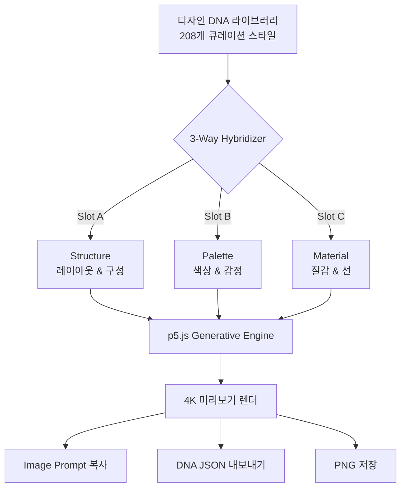

<div align="center">

# 🧬 DARLKOM v2.0

### *Design DNA Workstation*

**슬라이드 미학을 해부하고, 혼합하고, 재합성하는 프로페셔널 워크스테이션**

[](https://darlkom-banana-universe.netlify.app/)
[](https://darlkom-banana-universe.netlify.app/)
[](LICENSE)
[](https://p5js.org/)
[](https://developer.mozilla.org/en-US/docs/Web/JavaScript)

<br/>

> **"슬라이드 디자인의 '느낌'은 왜 복제하기 어려운가?"**
> Darlkom은 그 '느낌'을 **6개의 유전자 코드(DNA)** 로 해체하고,
> 수식처럼 재조합하는 도구이다.

[🚀 라이브 데모](https://darlkom-banana-universe.netlify.app/) · [📖 사용법 튜토리얼](https://darlkom-banana-universe.netlify.app/tutorial.html) · [🐛 이슈 리포트](../../issues)

</div>

---

## 🧠 Philosophy — "왜 만들었는가"

디자인 툴은 차고 넘친다. 하지만 대부분은 **어떻게(How)** 만드는지를 안내할 뿐,
**왜 그 디자인이 좋아 보이는지(Why)** 를 설명하지 않는다.

Darlkom은 다른 질문에서 시작했다.

> *"Bauhaus스러운 슬라이드와 Cyberpunk스러운 슬라이드의 차이는<br>
> 단순히 색상과 폰트의 차이인가? 아니면 더 깊은 구조가 있는가?"*

그 답이 **Design DNA**다.

### 핵심 설계 원칙

| 원칙 | 기존 방식 | Darlkom 방식 |
|------|-----------|--------------|
| **디자인 표현** | "파란색 + 고딕체 = 모던" | `color.primary=#6366f1` + `materiality.base=glass` + `emotion=["futuristic"]` |
| **스타일 전달** | 스크린샷 공유, 구두 설명 | DNA JSON 한 파일로 완전 재현 |
| **스타일 혼합** | Figma에서 수작업 카피 | 슬롯 3개 채우고 Synthesize 클릭 |
| **영감 발견** | Pinterest 무한 스크롤 | 208개 큐레이션 DNA 라이브러리 |



---

## ⚙️ 시스템 레이어 (Architecture)

### Layer 1 · Core — 6-Gene DNA Schema

모든 스타일 정보는 **MECE(상호 배타적 & 전체 포괄적)** 방식으로 6개 유전자에 저장된다.

```json
{
  "module_id": "DNA_001",
  "style_name": "Bauhaus Geometric Grid",
  "role_bucket": "Structure",
  "design_dna": {
    "layout_rules":    { "composition": "grid", "whitespace_ratio": 0.35 },
    "color_palette":   { "primary": "#312e81", "accent": "#a78bfa" },
    "materiality":     { "base": "matte", "texture": ["geometric"] },
    "line_shape":      { "weight": "bold", "style": "straight" },
    "typography":      { "headline": "sans-serif condensed" },
    "emotional_profile": { "mood": ["structured", "confident"] }
  },
  "image_prompt_one_line": "Bauhaus geometric grid layout..."
}
```

| 유전자 | 역할 | 예시 값 |
|--------|------|---------|
| `layout_rules` | 공간 구성, 여백 비율, 시선 흐름 | `grid`, `0.35`, `z-pattern` |
| `color_palette` | Primary/Secondary/Accent + 사용 규칙 | `#312e81`, `#6366f1`, `#a78bfa` |
| `materiality` | 기반 소재, 텍스처 오버레이 | `glass`, `grain`, `glitch` |
| `line_shape` | 선 굵기, 기하/유기적 여부 | `bold`, `straight` |
| `typography` | Serif/Sans 선택, 감정 키워드 | `serif dramatic` |
| `emotional_profile` | 생성 시드 역할 감정 태그 | `["futuristic", "cold"]` |

---

### Layer 2 · Bridge — 3-Way DNA Hybridizer

세 개의 슬롯에 다른 DNA를 조합할 때, 각 슬롯은 독립적인 역할을 담당한다.

```
Slot A (Structure) + Slot B (Palette) + Slot C (Material)
        ↓                   ↓                   ↓
   레이아웃 규칙          색상 시스템            질감 & 선
        └──────────────────┼───────────────────┘
                           ↓
              Hybrid DNA JSON (자동 생성)
                           ↓
              p5.js Generative Preview
```

> **Wow Moment**: Bauhaus의 격자 구조 + Cyberpunk의 네온 팔레트 + 일본 와비사비의 종이 질감  
> → 세상에 없던 슬라이드 스타일이 **3초** 만에 미리보기로 렌더된다.

---

### Layer 3 · Intelligence — Annotation Guide

슬라이드 *위에* 정보를 올리는 기술, **주석 인포그래픽 설계** 를 위한 50가지 전문 프롬프트.

- **10개 카테고리**: 공간 설계, 타이포그래피 대비, 색상 코딩, AI 메타 설계도 등
- **즉시 복사**: 각 프롬프트를 Midjourney/Gemini/NotebookLM에 바로 사용
- **카테고리 필터**: 용도별 빠른 탐색

---

## 🎯 수준별 활용 가이드

### 🟢 Starter — "일단 써보기"
> 목표: 5분 안에 슬라이드 이미지 프롬프트 하나 얻기

1. 사이트 접속 → 튜토리얼이 자동 시작 (첫 방문)
2. 검색창에 `neon` 또는 `minimal` 입력
3. 마음에 드는 DNA 카드 클릭
4. 우측 Inspector → `COPY IMAGE PROMPT`
5. **Midjourney에 붙여넣기** → 커버 이미지 생성 완료

### 🔵 Professional — "나만의 스타일 조합"
> 목표: 기존 에 없는 하이브리드 스타일 생성 및 저장

1. 필터로 `Structure` DNA 선택 → Slot A 설정
2. 다른 `Palette` DNA → Slot B, `Material` DNA → Slot C
3. `Synthesize` → p5.js 미리보기 확인
4. `Save as DNA` → 내 라이브러리에 자동 저장 (localStorage)
5. `COPY DNA JSON` → 다른 프로젝트에 스타일 이식

### 🟣 Enterprise — "팀 전체 디자인 언어 표준화"
> 목표: 조직의 슬라이드 스타일 가이드를 DNA 형태로 관리

1. Python 스크립트(`generate_designs.py`)로 대량 번역/생성
2. `templates.json` 에 팀 전용 DNA 추가 → 즉시 라이브러리에 반영
3. `COPY DNA JSON` 으로 팀원 간 스타일 공유 (재현성 100%)
4. Annotation Guide 50가지 프롬프트로 프레젠테이션 주석 가이드 작성

---

## 🔧 커스터마이징 & 확장

코어 로직을 건드리지 않고 세 가지 방법으로 확장 가능하다.

| 우선순위 | 방법 | 난이도 | 범위 |
|----------|------|--------|------|
| **1st** | `templates.json`에 DNA 추가 | ⭐ 쉬움 | 스타일 라이브러리 |
| **2nd** | `RenderEngine.js` 렌더 함수 Override | ⭐⭐ 중간 | 시각화 방식 |
| **3rd** | `app.js` 상태 관리 확장 | ⭐⭐⭐ 어려움 | 전체 워크플로우 |

### DNA 추가 (Priority 1 — 권장)

`templates.json` 배열에 아래 형식으로 객체를 추가하면 자동으로 라이브러리에 노출된다.

```json
{
  "module_id": "MY_CUSTOM_001",
  "style_name": "My Brand Style",
  "role_bucket": "Opening",
  "design_dna": {
    "color_palette": { "primary": "#yourcolor", "secondary": "#...", "accent": "#..." },
    "layout_rules":  { "composition": "asymmetric", "whitespace_ratio": 0.4 },
    "typography":    { "headline": "sans-serif bold", "body": "mono light" },
    "emotional_profile": { "mood": ["professional", "modern"] }
  },
  "image_prompt_one_line": "Your custom prompt here..."
}
```

---

## 🌐 다국어 지원 (Localization)

| 항목 | 현황 |
|------|------|
| UI 언어 | 한국어 (`ko`) / English (`en`) |
| 튜토리얼 | 한/영 실시간 토글 지원 |
| DNA 데이터 | 한국어 번역 완료 (208개) |
| Annotation 가이드 | 한국어 기준 작성 |

추가 언어 지원: `tutorial.html`의 `data-ko` / `data-en` 속성 패턴을 따라 `data-ja` 등을 추가하면 `setLang()` 함수가 자동 처리한다.

---

## 🚀 빠른 시작

```bash
# 클론
git clone https://github.com/Reasonofmoon/darlkom-banana.git
cd darlkom-banana

# 로컬 서버 실행 (JSON 파일 fetching을 위해 필수)
python -m http.server 8080
# 또는
npx serve .
```

브라우저에서 `http://localhost:8080` 접속 → 튜토리얼 자동 시작.

---

## 📂 프로젝트 구조

```
darlkom-banana/
├── index.html              # 메인 워크스테이션 UI
├── tutorial.html           # 인터랙티브 튜토리얼 (KO/EN)
├── app.js                  # 상태 관리 & 믹서 로직
├── RenderEngine.js         # p5.js 생성 아트 모듈
├── style.css               # Deep Indigo 다크 모드 디자인 시스템
├── templates.json          # DNA 데이터베이스 (208개)
├── annotation-design-guidelines-50.html   # 주석 가이드 데이터
└── generate_designs.py     # DNA 대량 생성 스크립트
```

---

## 📜 크레딧

| 역할 | 이름/도구 |
|------|-----------|
| **Developer** | [Reasonofmoon (Moon)](https://github.com/Reasonofmoon) |
| **Architecture** | Antigravity Agent (Google Gemini) |
| **Generative Engine** | [p5.js](https://p5js.org/) |
| **Icons** | [Lucide](https://lucide.dev/) |
| **Deployment** | [Netlify](https://netlify.com/) |

---

<div align="center">

**슬라이드 디자인을 유전자 코드로 이해하기 시작하면,<br>복제할 수 없는 '느낌'이라는 건 없다.**

[🌐 darlkom-banana-universe.netlify.app](https://darlkom-banana-universe.netlify.app/)

</div>
